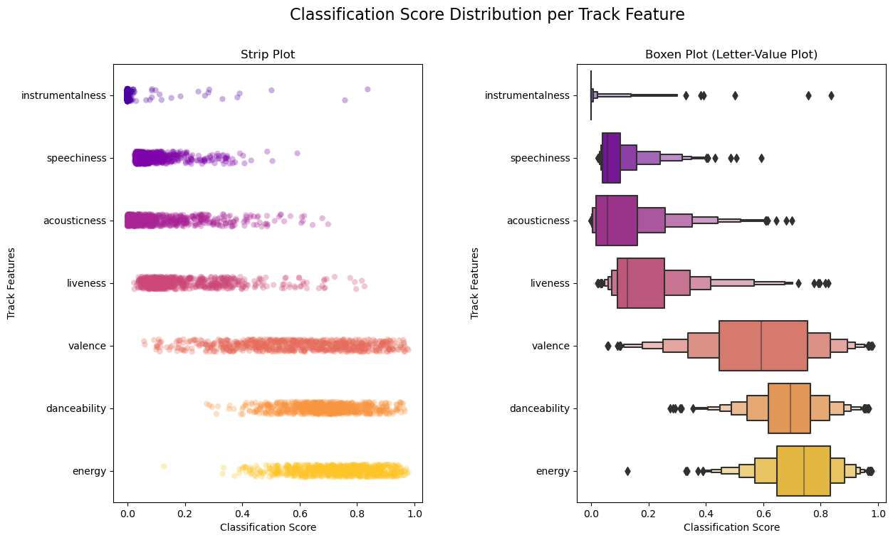

## Introduction

There is something so powerful about music. It can makes us laugh or it can make us cry. It can fill us with energy or it can relax us to sleep. It can remind us of the past or inspire us for the future. There are limitless ways to experience music, and that's what makes it so interesting to me. I've always had a true passion for music (my 80,000+ listening minutes on Spotify can attest to that), but it's not always easy to know if others will share the same liked songs. As the guy who loves creating new playlists (and has a giant speaker I bring everywhere I go), it's usually my job to pick the tunes at gatherings. Music is truly subjective when considering what's "good" or "bad", but I often rely on intuition for picking the right songs. While I *think* I do a decent job, I've always asked myself if there's a better way. What if I could use data to find the right songs? Now I could always rely on the experts to tell me what's popular, but what's the fun in that! Let's explore my music to see what insights we can find. 

### Objective:
    Identify trends in music from a playlist of songs to help identify songs that match the same trends.

### Guiding Questions:
    - Is a high popularity important?
    - What trends do we see as songs get older?
    - What trends do we see in technical song characteristics?
    - Do the identified song trends help us develop criteria for future songs?

## Data Overview

### About the Data

For our analysis, we will be using one of my favorite playlists I've created on Spotify called "Suns Out Guns Out" that I tried to make as a catch-all summer playlist for popular songs over the years. The playlist has 730 songs, a total listening time of 42.33 hours, and houses a variety of different genres. 

### Tools for the Job

**Tools we will need include:**
- Spotify API
- Python
- Python Libraries:
    - Numpy
    - Pandas
    - Matplotlib
    - Seaborn
    - Scipy
    - Spotipy
    
In order to access the data, we will need to use Spotify's provided API coupled with Spotipy for Python. This will allow us to pull all the necessary data from any playlist under my account. To conduct the analysis, we will utilize Pandas for our dataframe, Matplotlib and Seaborn for visualizations, and Scipy for statistical analysis. We will start by importing all our libaries and initiating a new token for access through the Spotify API. 


```python
import numpy as np
import pandas as pd
import seaborn as sns
from seaborn_qqplot import pplot
import matplotlib.pyplot as plt
import scipy.stats as sci
import os
import spotipy
from spotipy.oauth2 import SpotifyClientCredentials
from spotipy.oauth2 import SpotifyOAuth
```


```python
#This sets the environmental variables during this session
os.environ['SPOTIPY_CLIENT_ID'] = 'f9ac0ad027114dcf97963d2c4d2865d5'
os.environ['SPOTIPY_CLIENT_SECRET'] = '0b5d91bd79a24f1886eaa7c62a21fc8e'
os.environ['SPOTIPY_REDIRECT_URI'] = 'https://localhost:8888/callback'

#We create our Spotify object
sp = spotipy.Spotify(auth_manager=SpotifyOAuth(client_id='f9ac0ad027114dcf97963d2c4d2865d5',
                                               client_secret='0b5d91bd79a24f1886eaa7c62a21fc8e',
                                               redirect_uri='https://localhost:8888/callback',
                                               scope='user-library-read'))
```

## Data Extraction, Cleaning, and Transformation

Now that we have access to our data, we need to pull our data from Spotify into a dataframe before we can start cleaning or transforming. We will then display our dataframe to start learning about our data.


```python
remaining_songs = sp.playlist_tracks('https://open.spotify.com/playlist/4I8DT9gh83aBpiJRSEZ9Jb?si=d5aa22b7400b49d9')['total'] #Determine the total number of songs
offset=0
limit=100
saved_tracks = []

while True:
    
    #pulls a list of songs from the playlist based on the starting position (offset) and number of songs to pull (limit)
    tracks = sp.playlist_tracks('https://open.spotify.com/playlist/4I8DT9gh83aBpiJRSEZ9Jb?si=d5aa22b7400b49d9',offset=offset,limit=limit)['items']

    for track in tracks:
        
        #pulls the id, song name, album release date, first artist, first artist ID, and popularity and saves them in the saved_tracks list
        saved_tracks.append((track['track']['id'],
                             track['track']['name'],
                             track['track']['album']['release_date'], 
                             track['track']['artists'][0]['name'], 
                             track['track']['artists'][0]['id'], 
                             track['track']['popularity']))
        
    remaining_songs-=100
   
    #if we've reached the end of the playlist, exit the loop. Otherwise, change the starting position in the playlist and continue.
    if remaining_songs <=0:
        break
    else:
        offset+=limit

df = pd.DataFrame(data=saved_tracks,columns=['track_ID','name','release_date','artist','artist_ID','popularity'])
df
```


<div>
<style scoped>
    .dataframe tbody tr th:only-of-type {
        vertical-align: middle;
    }

    .dataframe tbody tr th {
        vertical-align: top;
    }

    .dataframe thead th {
        text-align: right;
    }
</style>
<table border="1" class="dataframe">
  <thead>
    <tr style="text-align: right;">
      <th></th>
      <th>track_ID</th>
      <th>name</th>
      <th>release_date</th>
      <th>artist</th>
      <th>artist_ID</th>
      <th>popularity</th>
    </tr>
  </thead>
  <tbody>
    <tr>
      <th>0</th>
      <td>4QNpBfC0zvjKqPJcyqBy9W</td>
      <td>Give Me Everything (feat. Ne-Yo, Afrojack &amp; Na...</td>
      <td>2011-06-17</td>
      <td>Pitbull</td>
      <td>0TnOYISbd1XYRBk9myaseg</td>
      <td>86</td>
    </tr>
    <tr>
      <th>1</th>
      <td>2bJvI42r8EF3wxjOuDav4r</td>
      <td>Time of Our Lives</td>
      <td>2014-11-21</td>
      <td>Pitbull</td>
      <td>0TnOYISbd1XYRBk9myaseg</td>
      <td>85</td>
    </tr>
    <tr>
      <th>2</th>
      <td>4kWO6O1BUXcZmaxitpVUwp</td>
      <td>Jackie Chan</td>
      <td>2018-05-18</td>
      <td>Tiësto</td>
      <td>2o5jDhtHVPhrJdv3cEQ99Z</td>
      <td>75</td>
    </tr>
    <tr>
      <th>3</th>
      <td>07nH4ifBxUB4lZcsf44Brn</td>
      <td>Blame (feat. John Newman)</td>
      <td>2014-10-31</td>
      <td>Calvin Harris</td>
      <td>7CajNmpbOovFoOoasH2HaY</td>
      <td>81</td>
    </tr>
    <tr>
      <th>4</th>
      <td>24LS4lQShWyixJ0ZrJXfJ5</td>
      <td>Sweet Nothing (feat. Florence Welch)</td>
      <td>2012-10-29</td>
      <td>Calvin Harris</td>
      <td>7CajNmpbOovFoOoasH2HaY</td>
      <td>77</td>
    </tr>
    <tr>
      <th>...</th>
      <td>...</td>
      <td>...</td>
      <td>...</td>
      <td>...</td>
      <td>...</td>
      <td>...</td>
    </tr>
    <tr>
      <th>725</th>
      <td>0JbSghVDghtFEurrSO8JrC</td>
      <td>Country Girl (Shake It For Me)</td>
      <td>2011-01-01</td>
      <td>Luke Bryan</td>
      <td>0BvkDsjIUla7X0k6CSWh1I</td>
      <td>81</td>
    </tr>
    <tr>
      <th>726</th>
      <td>57DJaoHdeeRrg7MWthNnee</td>
      <td>Body Back (feat. Maia Wright)</td>
      <td>2019-10-24</td>
      <td>Gryffin</td>
      <td>2ZRQcIgzPCVaT9XKhXZIzh</td>
      <td>62</td>
    </tr>
    <tr>
      <th>727</th>
      <td>0zKbDrEXKpnExhGQRe9dxt</td>
      <td>Lay Low</td>
      <td>2023-01-06</td>
      <td>Tiësto</td>
      <td>2o5jDhtHVPhrJdv3cEQ99Z</td>
      <td>88</td>
    </tr>
    <tr>
      <th>728</th>
      <td>3g5OlVimHO0rK6qmRiwokX</td>
      <td>Glad U Came</td>
      <td>2023-04-27</td>
      <td>Jason Derulo</td>
      <td>07YZf4WDAMNwqr4jfgOZ8y</td>
      <td>73</td>
    </tr>
    <tr>
      <th>729</th>
      <td>0qXGuBm0tmBLjC7InLM3EK</td>
      <td>Don't Say Love</td>
      <td>2023-06-16</td>
      <td>Leigh-Anne</td>
      <td>79QUtAVxGAAoiWNlqBz9iy</td>
      <td>75</td>
    </tr>
  </tbody>
</table>
<p>730 rows × 6 columns</p>
</div>


We now have a dataframe filled with songs from our playlist! Let's use this opportunity to make some quick observations of our data. We pulled the full 730 songs from our playlist, and there are a number of columns that were generated for each song. We pulled the unique track ID, song title (name), release date, artist, unique artist ID, and popularity score.

What is a popuarity score? Spotify describes it as the following: "The popularity of a track is a value between 0 and 100, with 100 being the most popular. The popularity is calculated by algorithm and is based, in the most part, on the total number of plays the track has had and how recent those plays are." (Spotify for Developers, n.d.) It's also important to highlight that every unique song has it's own calculated popularity score. The same song could have very different scores (ie. explicit vs non-explicit).

Another observation is the format of our release date column. It is currently in yyyy/mm/dd format, but for our analysis we'll want to see only the the year. We'll create a function to extract just the year from the date, apply it across the entire column, and generate a new column for the year.


```python
def release_year(date):
    return int(str(date)[:4])
```


```python
df['release_year'] = df['release_date'].apply(release_year)
df.head()
```


<div>
<style scoped>
    .dataframe tbody tr th:only-of-type {
        vertical-align: middle;
    }

    .dataframe tbody tr th {
        vertical-align: top;
    }

    .dataframe thead th {
        text-align: right;
    }
</style>
<table border="1" class="dataframe">
  <thead>
    <tr style="text-align: right;">
      <th></th>
      <th>track_ID</th>
      <th>name</th>
      <th>release_date</th>
      <th>artist</th>
      <th>artist_ID</th>
      <th>popularity</th>
      <th>release_year</th>
    </tr>
  </thead>
  <tbody>
    <tr>
      <th>0</th>
      <td>4QNpBfC0zvjKqPJcyqBy9W</td>
      <td>Give Me Everything (feat. Ne-Yo, Afrojack &amp; Na...</td>
      <td>2011-06-17</td>
      <td>Pitbull</td>
      <td>0TnOYISbd1XYRBk9myaseg</td>
      <td>86</td>
      <td>2011</td>
    </tr>
    <tr>
      <th>1</th>
      <td>2bJvI42r8EF3wxjOuDav4r</td>
      <td>Time of Our Lives</td>
      <td>2014-11-21</td>
      <td>Pitbull</td>
      <td>0TnOYISbd1XYRBk9myaseg</td>
      <td>85</td>
      <td>2014</td>
    </tr>
    <tr>
      <th>2</th>
      <td>4kWO6O1BUXcZmaxitpVUwp</td>
      <td>Jackie Chan</td>
      <td>2018-05-18</td>
      <td>Tiësto</td>
      <td>2o5jDhtHVPhrJdv3cEQ99Z</td>
      <td>75</td>
      <td>2018</td>
    </tr>
    <tr>
      <th>3</th>
      <td>07nH4ifBxUB4lZcsf44Brn</td>
      <td>Blame (feat. John Newman)</td>
      <td>2014-10-31</td>
      <td>Calvin Harris</td>
      <td>7CajNmpbOovFoOoasH2HaY</td>
      <td>81</td>
      <td>2014</td>
    </tr>
    <tr>
      <th>4</th>
      <td>24LS4lQShWyixJ0ZrJXfJ5</td>
      <td>Sweet Nothing (feat. Florence Welch)</td>
      <td>2012-10-29</td>
      <td>Calvin Harris</td>
      <td>7CajNmpbOovFoOoasH2HaY</td>
      <td>77</td>
      <td>2012</td>
    </tr>
  </tbody>
</table>
</div>


Nice! However, we need more data before we can continue with our analysis. Now that we have unique ID's for each individual track in the playlist, we can look-up the associated unique track features per song. We will be pulling different track features that are scored on a scale between 0 - 1. Where a score lies on the scale expresses information about the song. Table 3 below highlights the track features we'll be investigating along with the scale boundaries.

| Audio Feature    | Lower Boundary (0)              | Upper Boundary (1)               |
|------------------|---------------------------------|----------------------------------|
| **Acousticness**     | low confidence acoustic         | high confidence acoustic         |
| **Danceability**     | least danceable                 | most danceable                   |
| **Energy**           | low energy                      | high energy (fast, loud, noisy)  |
| **Instrumentalness** | not instrumental                | instrumental (no vocals)         |
| **Liveness**         | not live                        | live (audience present)          |
| **speechiness**      | low vocal level (no vocals)     | high vocal level (audio book)    |
| **Valence**          | negative sound (sad, depressed) | positive sound (happy, cheerful) |

<p style="text-align: center;"> Table 1. Track Audio Feature Boundaries and Definitions (Spotify, n.d.) </p>

Just like we pulled our data from the playlist, we'll look up each unique track ID and pull the track audio features into a new dataframe. Once we have two dataframes with the same unique track ID's (unique primary keys), we can utilize a merge operation to combine the dataframes. In this case, we will conduct an inner join to produce our new dataframe will all the data together. In order to ensure we have a clean merge, let's first clean our primary key's on each dataframe to remove any potential duplicates. Once that is complete we can move forward with the merge. The very last thing to complete the cleaning process is checking for any empty values (set as "DEFAULT" in our program) before we move on to the analysis phase.


```python
remaining_songs = sp.playlist_tracks('https://open.spotify.com/playlist/4I8DT9gh83aBpiJRSEZ9Jb?si=d5aa22b7400b49d9')['total'] #Determine the total number of songs
track_ids = list(df['track_ID'])
track_subset = []
features_list = []
offset = 0
limit = 100

while True:
    
    #pulls a subset of tracks from the track list
    track_subset = track_ids[offset:offset+limit]
    
    #pulls track audio features for the subset of tracks as a Spotipy object
    audio_features_results = sp.audio_features(track_subset)
    
    #For each location and track in the Spotipy object, create a new tuple that is appended to a features list.
    #If there is no data available for a track, populate the values with a generic string "DEFAULT".
    for index,track in enumerate(audio_features_results):
        
        try:
            feature_tuple = (track['id'],
                             track['acousticness'],
                             track['danceability'],
                             track['energy'],
                             track['instrumentalness'],
                             track['liveness'],
                             track['speechiness'],
                             track['valence'])
            
            features_list.append(feature_tuple)
            
        except TypeError:
            feature_tuple = (track_subset[index],
                             "DEFAULT",
                             "DEFAULT",
                             "DEFAULT",
                             "DEFAULT",
                             "DEFAULT",
                             "DEFAULT",
                             "DEFAULT",)
            
            features_list.append(feature_tuple)
            

    remaining_songs-=limit
    
    #if we've reached the end of the playlist, exit the loop. Otherwise, change the starting position in the playlist and continue.
    if remaining_songs <=0:
        break
    else:
        offset+=limit

features_df = pd.DataFrame(data=features_list,columns=['track_ID',
                                                       'acousticness',
                                                       'danceability',
                                                       'energy',
                                                       'instrumentalness',
                                                       'liveness',
                                                       'speechiness',
                                                       'valence'])
```


```python
#remove duplicates in both dataframes then generate a new dataframe by merging both dataframes on 'track_ID'
df = df.drop_duplicates(subset=['track_ID'])
features_df = features_df.drop_duplicates(subset=['track_ID'])
playlist_df = pd.merge(df,features_df,how='inner',on='track_ID')

#loop through the new dataframe playlist_df and delete any rows containing 'DEFAULT'. If one column is empty, all columns are empty.
index = []
empty_tracks_df = playlist_df[playlist_df['acousticness'] == 'DEFAULT']

for val in empty_tracks_df.index:
    playlist_df = playlist_df.drop(val,axis=0)
    
playlist_df
```


<div>
<style scoped>
    .dataframe tbody tr th:only-of-type {
        vertical-align: middle;
    }

    .dataframe tbody tr th {
        vertical-align: top;
    }

    .dataframe thead th {
        text-align: right;
    }
</style>
<table border="1" class="dataframe">
  <thead>
    <tr style="text-align: right;">
      <th></th>
      <th>track_ID</th>
      <th>name</th>
      <th>release_date</th>
      <th>artist</th>
      <th>artist_ID</th>
      <th>popularity</th>
      <th>release_year</th>
      <th>acousticness</th>
      <th>danceability</th>
      <th>energy</th>
      <th>instrumentalness</th>
      <th>liveness</th>
      <th>speechiness</th>
      <th>valence</th>
    </tr>
  </thead>
  <tbody>
    <tr>
      <th>0</th>
      <td>4QNpBfC0zvjKqPJcyqBy9W</td>
      <td>Give Me Everything (feat. Ne-Yo, Afrojack &amp; Na...</td>
      <td>2011-06-17</td>
      <td>Pitbull</td>
      <td>0TnOYISbd1XYRBk9myaseg</td>
      <td>86</td>
      <td>2011</td>
      <td>0.19100</td>
      <td>0.671</td>
      <td>0.939</td>
      <td>0.000000</td>
      <td>0.2980</td>
      <td>0.1610</td>
      <td>0.530</td>
    </tr>
    <tr>
      <th>1</th>
      <td>2bJvI42r8EF3wxjOuDav4r</td>
      <td>Time of Our Lives</td>
      <td>2014-11-21</td>
      <td>Pitbull</td>
      <td>0TnOYISbd1XYRBk9myaseg</td>
      <td>85</td>
      <td>2014</td>
      <td>0.09210</td>
      <td>0.721</td>
      <td>0.802</td>
      <td>0.000000</td>
      <td>0.6940</td>
      <td>0.0583</td>
      <td>0.724</td>
    </tr>
    <tr>
      <th>2</th>
      <td>4kWO6O1BUXcZmaxitpVUwp</td>
      <td>Jackie Chan</td>
      <td>2018-05-18</td>
      <td>Tiësto</td>
      <td>2o5jDhtHVPhrJdv3cEQ99Z</td>
      <td>75</td>
      <td>2018</td>
      <td>0.37400</td>
      <td>0.747</td>
      <td>0.834</td>
      <td>0.000000</td>
      <td>0.0586</td>
      <td>0.0450</td>
      <td>0.687</td>
    </tr>
    <tr>
      <th>3</th>
      <td>07nH4ifBxUB4lZcsf44Brn</td>
      <td>Blame (feat. John Newman)</td>
      <td>2014-10-31</td>
      <td>Calvin Harris</td>
      <td>7CajNmpbOovFoOoasH2HaY</td>
      <td>81</td>
      <td>2014</td>
      <td>0.02870</td>
      <td>0.414</td>
      <td>0.857</td>
      <td>0.005740</td>
      <td>0.3430</td>
      <td>0.0808</td>
      <td>0.348</td>
    </tr>
    <tr>
      <th>4</th>
      <td>24LS4lQShWyixJ0ZrJXfJ5</td>
      <td>Sweet Nothing (feat. Florence Welch)</td>
      <td>2012-10-29</td>
      <td>Calvin Harris</td>
      <td>7CajNmpbOovFoOoasH2HaY</td>
      <td>77</td>
      <td>2012</td>
      <td>0.19700</td>
      <td>0.573</td>
      <td>0.929</td>
      <td>0.000112</td>
      <td>0.0567</td>
      <td>0.1090</td>
      <td>0.582</td>
    </tr>
    <tr>
      <th>...</th>
      <td>...</td>
      <td>...</td>
      <td>...</td>
      <td>...</td>
      <td>...</td>
      <td>...</td>
      <td>...</td>
      <td>...</td>
      <td>...</td>
      <td>...</td>
      <td>...</td>
      <td>...</td>
      <td>...</td>
      <td>...</td>
    </tr>
    <tr>
      <th>721</th>
      <td>0JbSghVDghtFEurrSO8JrC</td>
      <td>Country Girl (Shake It For Me)</td>
      <td>2011-01-01</td>
      <td>Luke Bryan</td>
      <td>0BvkDsjIUla7X0k6CSWh1I</td>
      <td>81</td>
      <td>2011</td>
      <td>0.02930</td>
      <td>0.645</td>
      <td>0.904</td>
      <td>0.000000</td>
      <td>0.0834</td>
      <td>0.0462</td>
      <td>0.671</td>
    </tr>
    <tr>
      <th>722</th>
      <td>57DJaoHdeeRrg7MWthNnee</td>
      <td>Body Back (feat. Maia Wright)</td>
      <td>2019-10-24</td>
      <td>Gryffin</td>
      <td>2ZRQcIgzPCVaT9XKhXZIzh</td>
      <td>62</td>
      <td>2019</td>
      <td>0.09310</td>
      <td>0.687</td>
      <td>0.832</td>
      <td>0.000001</td>
      <td>0.1830</td>
      <td>0.0366</td>
      <td>0.448</td>
    </tr>
    <tr>
      <th>723</th>
      <td>0zKbDrEXKpnExhGQRe9dxt</td>
      <td>Lay Low</td>
      <td>2023-01-06</td>
      <td>Tiësto</td>
      <td>2o5jDhtHVPhrJdv3cEQ99Z</td>
      <td>88</td>
      <td>2023</td>
      <td>0.06070</td>
      <td>0.534</td>
      <td>0.855</td>
      <td>0.000263</td>
      <td>0.3460</td>
      <td>0.1830</td>
      <td>0.420</td>
    </tr>
    <tr>
      <th>724</th>
      <td>3g5OlVimHO0rK6qmRiwokX</td>
      <td>Glad U Came</td>
      <td>2023-04-27</td>
      <td>Jason Derulo</td>
      <td>07YZf4WDAMNwqr4jfgOZ8y</td>
      <td>73</td>
      <td>2023</td>
      <td>0.00627</td>
      <td>0.675</td>
      <td>0.801</td>
      <td>0.000000</td>
      <td>0.3710</td>
      <td>0.0579</td>
      <td>0.521</td>
    </tr>
    <tr>
      <th>725</th>
      <td>0qXGuBm0tmBLjC7InLM3EK</td>
      <td>Don't Say Love</td>
      <td>2023-06-16</td>
      <td>Leigh-Anne</td>
      <td>79QUtAVxGAAoiWNlqBz9iy</td>
      <td>75</td>
      <td>2023</td>
      <td>0.01170</td>
      <td>0.703</td>
      <td>0.883</td>
      <td>0.000000</td>
      <td>0.2550</td>
      <td>0.1840</td>
      <td>0.812</td>
    </tr>
  </tbody>
</table>
<p>726 rows × 14 columns</p>
</div>


Great success! We now have a complete dataframe with all the data we need from our playlist. The next step is to conduct our analysis.

## Data Analysis

For our data analysis, let's start with simply getting to know our data. We'll ulitize python's describe function to get statistical information regarding our dataset.


```python
playlist_df.describe()
```


<div>
<style scoped>
    .dataframe tbody tr th:only-of-type {
        vertical-align: middle;
    }

    .dataframe tbody tr th {
        vertical-align: top;
    }

    .dataframe thead th {
        text-align: right;
    }
</style>
<table border="1" class="dataframe">
  <thead>
    <tr style="text-align: right;">
      <th></th>
      <th>popularity</th>
      <th>release_year</th>
      <th>acousticness</th>
      <th>danceability</th>
      <th>energy</th>
      <th>instrumentalness</th>
      <th>liveness</th>
      <th>speechiness</th>
      <th>valence</th>
    </tr>
  </thead>
  <tbody>
    <tr>
      <th>count</th>
      <td>726.000000</td>
      <td>726.000000</td>
      <td>726.000000</td>
      <td>726.000000</td>
      <td>726.000000</td>
      <td>726.000000</td>
      <td>726.000000</td>
      <td>726.000000</td>
      <td>726.000000</td>
    </tr>
    <tr>
      <th>mean</th>
      <td>61.128099</td>
      <td>2013.151515</td>
      <td>0.108295</td>
      <td>0.689017</td>
      <td>0.731063</td>
      <td>0.008038</td>
      <td>0.185606</td>
      <td>0.087175</td>
      <td>0.588983</td>
    </tr>
    <tr>
      <th>std</th>
      <td>27.680420</td>
      <td>10.242800</td>
      <td>0.128209</td>
      <td>0.122136</td>
      <td>0.133644</td>
      <td>0.056529</td>
      <td>0.141560</td>
      <td>0.077953</td>
      <td>0.207926</td>
    </tr>
    <tr>
      <th>min</th>
      <td>0.000000</td>
      <td>1968.000000</td>
      <td>0.000018</td>
      <td>0.276000</td>
      <td>0.127000</td>
      <td>0.000000</td>
      <td>0.022600</td>
      <td>0.025200</td>
      <td>0.057900</td>
    </tr>
    <tr>
      <th>25%</th>
      <td>54.000000</td>
      <td>2009.000000</td>
      <td>0.017900</td>
      <td>0.618000</td>
      <td>0.647000</td>
      <td>0.000000</td>
      <td>0.090900</td>
      <td>0.040700</td>
      <td>0.446500</td>
    </tr>
    <tr>
      <th>50%</th>
      <td>72.000000</td>
      <td>2017.000000</td>
      <td>0.058250</td>
      <td>0.696500</td>
      <td>0.741500</td>
      <td>0.000000</td>
      <td>0.128000</td>
      <td>0.057450</td>
      <td>0.594000</td>
    </tr>
    <tr>
      <th>75%</th>
      <td>80.000000</td>
      <td>2020.000000</td>
      <td>0.162000</td>
      <td>0.763750</td>
      <td>0.833000</td>
      <td>0.000033</td>
      <td>0.255000</td>
      <td>0.100750</td>
      <td>0.754750</td>
    </tr>
    <tr>
      <th>max</th>
      <td>97.000000</td>
      <td>2023.000000</td>
      <td>0.699000</td>
      <td>0.967000</td>
      <td>0.978000</td>
      <td>0.837000</td>
      <td>0.826000</td>
      <td>0.592000</td>
      <td>0.979000</td>
    </tr>
  </tbody>
</table>
</div>


There's a lot to unpack with this data, but we can make some initial observations:
- Popularity scores fluctate a lot. The mean score is around 61 out of 100, but standard deviation is quite high at around 27.5.
- Songs generally have high danceability, energy, and valence based on their mean values (scale 0-1).
- Songs generally have low instrumentalness, speechiness, acoustics, and liveness based on their mean values (scale 0-1).
- Songs are fairly modern with the mean year being around 2013 and a standard deviation of around 10.

The release year data shows that the majority of the songs tend to be more modern, but songs go back as far as 1968! Popularity, on the other hand, is a lot more merky. 50% of the data is between 54 and 80 and a mean of 61 suggests that popularity is generally high, but that's not the full story. There is quite a large standard deviation at 27.5 and at least one 0 score present in the dataset. Let's plot the popularity and release year variables on a histogram to get a better idea of the distribution.


```python
#define the size of the figure
fig,ax = plt.subplots(1,2,figsize=(14,6))

#histogram plot generation
sns.histplot(data=df,x='popularity',color='royalblue',ax=ax[0])
sns.histplot(data=df,x='release_year',bins=20,color='royalblue',ax=ax[1])

#title and label generation
plt.suptitle("Playlist Track Popularity and Year Distribution",fontsize=16)
ax[0].set_title("Track Popularity Distribution")
ax[1].set_title("Track Release Year Distribution")
ax[0].set_xlabel("Popularity")
ax[1].set_xlabel("Year")

#tweak proximity of plots to each other
fig.subplots_adjust(left=None,
    bottom=None,
    right=None,
    top=None,
    wspace=0.3,
    hspace=0.1,)

plt.show()
```


    

    


Woah, that's a lot of songs with a popularity score close to 0! It's important to consider that popularity scores are derived from a spotify algorithm that considers the number of times a song is played and how recent those plays are (Spotify, n.d.). It's also important to consider that every song on spotify is ranked independently, so duplicates of the same song can have different scores. One version of the song on Spotify could have a signifcantly different score compared to another version (ex: explicit vs non-explicit). It's possible that the songs ranked at 0 in the playlist are a mix of songs I like that aren't popular and songs that are not from the original album. Further analysis is required. Looking at the rest of the popularity data shows generally the songs in the playlist tend toward a high popularity.

Looking at the release years show an expotential trend of increasing track counts as the year increases. There are a handful of songs that are added from 1968 to around the mid 1990's, but the quantity quickly increases afterwards. This data shows that the songs in the playlist tend toward more modern songs.

What about the song audio features? Let's plot those as well to get a better idea of their behavior. We'll first transform the data into something easier to plot. Next, we'll generate two plots. The first plot will be a strip plot with all data points plotted for each audio feature. The second plot will be a boxen plot (letter-value plot) for each audio feature.


```python
#Transform dataframe for all audio features to be in one column with their respective values in a second column
features_df_transformed = pd.melt(features_df,value_vars=['acousticness',
                                                          'danceability',
                                                          'energy',
                                                          'instrumentalness',
                                                          'liveness',
                                                          'speechiness',
                                                          'valence'])
```


```python
#define the size of the figure
fig,ax = plt.subplots(1,2,figsize=(14,8))

#boxen plot generation
sns.boxenplot(data=features_df_transformed, 
              y='variable', 
              x='value', 
              palette='plasma',
              ax=ax[1],
              order=['instrumentalness',
                     'speechiness',
                     'acousticness',
                     'liveness',
                     'valence',
                     'danceability',
                     'energy'])

#strip plot generation
sns.stripplot(data=features_df_transformed,
              y='variable',
              x='value',
              size=6, 
              alpha=0.3, 
              order=['instrumentalness',
                     'speechiness',
                     'acousticness',
                     'liveness',
                     'valence',
                     'danceability',
                     'energy'],
              palette='plasma',
              ax=ax[0])

#title and label generation
plt.suptitle("Classification Score Distribution per Track Feature",fontsize=16)
ax[0].set_title("Strip Plot")
ax[1].set_title("Boxen Plot (Letter-Value Plot)")
ax[0].set_ylabel("Audio Features")
ax[1].set_ylabel("Audio Features")
ax[0].set_xlabel("Classification Score")
ax[1].set_xlabel("Classification Score")

#tweak proximity of plots to each other
fig.subplots_adjust(left=None,
    bottom=None,
    right=None,
    top=None,
    wspace=0.5,
    hspace=0.1,)

plt.show()
```


    

    


Investigating our the strip plot first shows the overall density of points across the classification score scale from 0 to 1. An alpha value (translucency) of 0.3 was used to better highlight overlapping values. The audio features have been sorted in descending order from smallest mean to largest mean for the dataset. Reviewing our strip plot and coorelating back to Table 1 helps us visualize the general concentration of points thus the general characteristics of our playlist. We see a very low instrumentalness, speechiness, acousticness, and liveness. We also see a relatively high danceability and energy. This suggests that the playlist has a lot of songs that are danceable; are fast, loud, and noisy; are not live recordings; and have enough vocals to not be instrumental while also not being a podcast or audio book. Valence is fairly evenly distributed suggesting that the playlist has a mix of positive and negative sounding songs. We also notice that there are many potential outliers in the data, but a strip plot doesn't give us a lot of descriptive information. That's where a boxen plot comes in.

The second plot is a boxen plot (letter-value plot) that gives us a bit more information on the data distribution. The largest two boxes in the middle represent 50% of the data. The next two boxes (one on each side) together represent another 25% of the data. Each series of boxes cuts the percentage in half from the previous (12.5%, 6.25%, etc). The boxen plot helps us confirm where the largest concentrations of data points are as well as the outliers in our data (represented by the black diamonds). We see that the majority of our data is fairly concentrated for each audio feature, but there are significant tails present as well as outliers for each audio feature.

How can we use this data to help us decide which songs would be a good or bad fit for our playlist? Ideally, we want to take a mathematical approach to guarantee the best possible accuracy in our predictions. The first observation we want to make in our quest for picking the best mathematical solution is to determine if we are dealing with a normal distribution or not. Normal distributions can help make our lives a lot easier, but unfortunately our boxen plot helps us visualize that our data may not fit a normal distribution too well. Let's double check by utilizing a more specific tool called a QQ plot. While this won't tell us what the distribution is, it can tell us what it's NOT. Let's plot our data on the QQ plot to determine if we have a normal distribution.


```python
#pplot generation
pplot(features_df_transformed,y=sci.norm,x='value',hue='variable',kind='qq',height=6,aspect=2,display_kws={"identity":True})

#title, label, annotation generation
plt.title("QQ Plot")
plt.ylabel("Normal Distribution")
plt.xlabel("Classification Score")
plt.annotate('The closer points follow the x=y line, \n the closer the data is to a normal distribution. ', 
             xy=(1.1, 1.1), 
             xycoords='data',
            xytext=(1, -0.55), 
             bbox=dict(boxstyle="round", fc="w"),
             va="center", 
             ha="center", 
             size=12,
            arrowprops=dict(arrowstyle="->,head_width=0.4,head_length=0.6",facecolor='black',connectionstyle="arc3,rad=0.1",fc="w",relpos=(0.75, 0.)))

plt.show()
```


    

    


What we are looking for with a QQ plot is whether the points closely follow the x=y line for the given distribution, but unfortunately it seems none of our audio features are well defined by a normal distribution. We could use this opportunity to determine the best possible distribution model for each individual audio feature with tools such as the fitter python library, but for simplicities sake, there is an alternative option we can employ. We can use Chebyshev's inequality.

**Chebyshev's inequality (also called Bienaymé–Chebyshev inequality) states that:**

For a wide class of probability distributions, no more than a certain fraction of values can be more than a certain distance from the mean. Specifically, no more than 1/k2 of the distribution's values can be k or more standard deviations away from the mean ("Chebyshev's inequality", 2023).

insert equation here

In a normal distribution, we could confidently say that 95% of the data would fit within 2 standard deviations from the mean. Using Chebyshev's inequality, we can conclude that 75% of the data will fit within 2 standard deviations of the mean for a wide range of different distributions. Using these bounds does not give us the same level of accuracy we can expect with a normal distribution, but it does allow us to better identify values in our data which would correlate to a song better fitting our playlist.

## Putting the Data into Action

Now that we've identified the general characteristics of our playlist data, we can use this information to help us predict which songs may fit better into our playlist. We will use a range of values 2 standard deviations from the mean for each audio feature to help us develop a filter for the type of songs we want. We will upload a new dataframe of over 6,000 songs (my liked songs on Spotify) to identify which would best fit our new criteria.

For our analysis, we will start by calculating the upper and lower bounds of our target values based on 2 standard deviations from the mean.


```python
pop_min = df['popularity'].mean() - 2*df['popularity'].std()
pop_max = df['popularity'].mean() + 2*df['popularity'].std()
year_min = df['release_year'].mean() - 2*df['release_year'].std()
year_max = df['release_year'].mean() + 2*df['release_year'].std()
acoust_min = features_df['acousticness'].mean() - 2*features_df['acousticness'].std()
acoust_max = features_df['acousticness'].mean() + 2*features_df['acousticness'].std()
dance_min = features_df['danceability'].mean() - 2*features_df['danceability'].std()
dance_max = features_df['danceability'].mean() + 2*features_df['danceability'].std()
en_min = features_df['energy'].mean() - 2*features_df['energy'].std()
en_max = features_df['energy'].mean() + 2*features_df['energy'].std()
instru_min = features_df['instrumentalness'].mean() - 2*features_df['instrumentalness'].std()
instru_max = features_df['instrumentalness'].mean() + 2*features_df['instrumentalness'].std()
live_min = features_df['liveness'].mean() - 2*features_df['liveness'].std()
live_max = features_df['liveness'].mean() + 2*features_df['liveness'].std()
speech_min = features_df['speechiness'].mean() - 2*features_df['speechiness'].std()
speech_max = features_df['speechiness'].mean() + 2*features_df['speechiness'].std()
val_min = features_df['valence'].mean() - 2*features_df['valence'].std()
val_max = features_df['valence'].mean() + 2*features_df['valence'].std()
```

We will now pull the full dataset of over 6000 songs into a new dataframe, pull the associated audio features for each song into a different dataframe, and merge the dataframes together as we did in our initial exercise.


```python
remaining_songs = sp.current_user_saved_tracks()['total']
offset=0
limit=50
saved_tracks = []

while True:
    
    spotify_liked_songs = sp.current_user_saved_tracks(limit,offset)
    tracks = spotify_liked_songs['items']
    
    for track in tracks:
        
        saved_tracks.append((track['track']['id'],
                             track['track']['name'],
                             track['track']['album']['release_date'], 
                             track['track']['artists'][0]['name'], 
                             track['track']['artists'][0]['id'], 
                             track['track']['popularity']))
        
    remaining_songs-=limit
   
    if remaining_songs <=0:
        break
    else:
        offset+=limit
        
liked_songs_df = pd.DataFrame(data=saved_tracks,columns=['track_ID','name','release_date','artist','artist_ID','popularity'])
```


```python
remaining_songs = sp.current_user_saved_tracks()['total']
track_ids = list(liked_songs_df['track_ID'])
track_subset = []
features_list = []
offset = 0
limit = 50

while True:
    
    track_subset = track_ids[offset:offset+limit]
    
    audio_features_results = sp.audio_features(track_subset)
    
    for index,track in enumerate(audio_features_results):
        
        try:
            feature_tuple = (track['id'],
                             track['acousticness'],
                             track['danceability'],
                             track['energy'],
                             track['instrumentalness'],
                             track['liveness'],
                             track['speechiness'],
                             track['valence'])
            
            features_list.append(feature_tuple)
            
        except TypeError:
            feature_tuple = (track_subset[index],
                             "DEFAULT",
                             "DEFAULT",
                             "DEFAULT",
                             "DEFAULT",
                             "DEFAULT",
                             "DEFAULT",
                             "DEFAULT",)
            
            features_list.append(feature_tuple)
            

    remaining_songs-=limit
    
    if remaining_songs <=0:
        break
    else:
        offset+=limit

liked_songs_features_df = pd.DataFrame(data=features_list,columns=['track_ID',
                                                                   'acousticness',
                                                                   'danceability',
                                                                   'energy',
                                                                   'instrumentalness',
                                                                   'liveness',
                                                                   'speechiness',
                                                                   'valence'])
```


```python
#remove duplicates in both dataframes then generate a new dataframe by merging both dataframes on 'track_ID. At the end of the merge, create a new release_year column.'
liked_songs_df = liked_songs_df.drop_duplicates(subset=['track_ID'])
liked_songs_features_df = liked_songs_features_df.drop_duplicates(subset=['track_ID'])
merged_df = pd.merge(liked_songs_df,liked_songs_features_df,how='inner',on='track_ID')
merged_df['release_year'] = merged_df['release_date'].apply(release_year)

#loop through the new dataframe playlist_df and delete any rows containing 'DEFAULT'. If one column is empty, all columns are empty.
index = []
empty_tracks_df = merged_df[merged_df['acousticness'] == 'DEFAULT']

for val in empty_tracks_df.index:
    merged_df = merged_df.drop(val,axis=0)

merged_df
```


<div>
<style scoped>
    .dataframe tbody tr th:only-of-type {
        vertical-align: middle;
    }

    .dataframe tbody tr th {
        vertical-align: top;
    }

    .dataframe thead th {
        text-align: right;
    }
</style>
<table border="1" class="dataframe">
  <thead>
    <tr style="text-align: right;">
      <th></th>
      <th>track_ID</th>
      <th>name</th>
      <th>release_date</th>
      <th>artist</th>
      <th>artist_ID</th>
      <th>popularity</th>
      <th>acousticness</th>
      <th>danceability</th>
      <th>energy</th>
      <th>instrumentalness</th>
      <th>liveness</th>
      <th>speechiness</th>
      <th>valence</th>
      <th>release_year</th>
    </tr>
  </thead>
  <tbody>
    <tr>
      <th>0</th>
      <td>07FMnItEdDXZ2WAgNR9n6a</td>
      <td>Would You Even Know</td>
      <td>2023-05-26</td>
      <td>Audien</td>
      <td>4xnMDfgEmXZEEDdITKcGuE</td>
      <td>60</td>
      <td>0.109</td>
      <td>0.505</td>
      <td>0.804</td>
      <td>0</td>
      <td>0.124</td>
      <td>0.0438</td>
      <td>0.253</td>
      <td>2023</td>
    </tr>
    <tr>
      <th>1</th>
      <td>3lzmoZIPWJxew5Tjyi715j</td>
      <td>Deep Blue</td>
      <td>2019-08-22</td>
      <td>William Black</td>
      <td>7d5SfGXKpgS3JK8BFIq59h</td>
      <td>57</td>
      <td>0.566</td>
      <td>0.564</td>
      <td>0.722</td>
      <td>0.000001</td>
      <td>0.323</td>
      <td>0.0444</td>
      <td>0.244</td>
      <td>2019</td>
    </tr>
    <tr>
      <th>2</th>
      <td>4QcfHUpGxGGKh7VIVs3LYI</td>
      <td>Wish I Could Forget (with blackbear &amp; Bring Me...</td>
      <td>2023-05-19</td>
      <td>SLANDER</td>
      <td>20DZAfCuP1TKZl5KcY7z3Q</td>
      <td>73</td>
      <td>0.01</td>
      <td>0.589</td>
      <td>0.699</td>
      <td>0</td>
      <td>0.0925</td>
      <td>0.0388</td>
      <td>0.171</td>
      <td>2023</td>
    </tr>
    <tr>
      <th>3</th>
      <td>19m23w2ANVhtB7rApM6pbN</td>
      <td>Back To U</td>
      <td>2020-04-24</td>
      <td>SLANDER</td>
      <td>20DZAfCuP1TKZl5KcY7z3Q</td>
      <td>60</td>
      <td>0.645</td>
      <td>0.586</td>
      <td>0.499</td>
      <td>0</td>
      <td>0.109</td>
      <td>0.049</td>
      <td>0.272</td>
      <td>2020</td>
    </tr>
    <tr>
      <th>4</th>
      <td>2ibGdhv3nTO89VN9KR7N2H</td>
      <td>In A Perfect World (with Julia Michaels)</td>
      <td>2023-06-29</td>
      <td>Dean Lewis</td>
      <td>3QSQFmccmX81fWCUSPTS7y</td>
      <td>67</td>
      <td>0.186</td>
      <td>0.713</td>
      <td>0.451</td>
      <td>0</td>
      <td>0.439</td>
      <td>0.0406</td>
      <td>0.316</td>
      <td>2023</td>
    </tr>
    <tr>
      <th>...</th>
      <td>...</td>
      <td>...</td>
      <td>...</td>
      <td>...</td>
      <td>...</td>
      <td>...</td>
      <td>...</td>
      <td>...</td>
      <td>...</td>
      <td>...</td>
      <td>...</td>
      <td>...</td>
      <td>...</td>
      <td>...</td>
    </tr>
    <tr>
      <th>6121</th>
      <td>6FxMzrdk9dmjUMLdHeL5tl</td>
      <td>Miss Atomic Bomb</td>
      <td>2013-01-01</td>
      <td>The Killers</td>
      <td>0C0XlULifJtAgn6ZNCW2eu</td>
      <td>42</td>
      <td>0.0234</td>
      <td>0.56</td>
      <td>0.722</td>
      <td>0.000027</td>
      <td>0.257</td>
      <td>0.0315</td>
      <td>0.348</td>
      <td>2013</td>
    </tr>
    <tr>
      <th>6122</th>
      <td>6HOcAwQAAKaj1GHntfmSoI</td>
      <td>When You Were Young - Calvin Harris Remix</td>
      <td>2013-01-01</td>
      <td>The Killers</td>
      <td>0C0XlULifJtAgn6ZNCW2eu</td>
      <td>45</td>
      <td>0.000162</td>
      <td>0.586</td>
      <td>0.918</td>
      <td>0.0543</td>
      <td>0.199</td>
      <td>0.0942</td>
      <td>0.459</td>
      <td>2013</td>
    </tr>
    <tr>
      <th>6123</th>
      <td>6aKWBLAFHXHUjsJJri2ota</td>
      <td>When You Were Young</td>
      <td>2013-01-01</td>
      <td>The Killers</td>
      <td>0C0XlULifJtAgn6ZNCW2eu</td>
      <td>41</td>
      <td>0.000335</td>
      <td>0.441</td>
      <td>0.976</td>
      <td>0.0475</td>
      <td>0.298</td>
      <td>0.147</td>
      <td>0.248</td>
      <td>2013</td>
    </tr>
    <tr>
      <th>6124</th>
      <td>75CgwX1tMoPfE8C4ZR14D8</td>
      <td>For Reasons Unknown</td>
      <td>2013-01-01</td>
      <td>The Killers</td>
      <td>0C0XlULifJtAgn6ZNCW2eu</td>
      <td>43</td>
      <td>0.000433</td>
      <td>0.496</td>
      <td>0.889</td>
      <td>0.0415</td>
      <td>0.122</td>
      <td>0.0372</td>
      <td>0.519</td>
      <td>2013</td>
    </tr>
    <tr>
      <th>6125</th>
      <td>6HFbq7cewJ7rPiffV0ciil</td>
      <td>A Sky Full of Stars</td>
      <td>2014-05-02</td>
      <td>Coldplay</td>
      <td>4gzpq5DPGxSnKTe4SA8HAU</td>
      <td>60</td>
      <td>0.00617</td>
      <td>0.545</td>
      <td>0.675</td>
      <td>0.00197</td>
      <td>0.209</td>
      <td>0.0279</td>
      <td>0.162</td>
      <td>2014</td>
    </tr>
  </tbody>
</table>
<p>6125 rows × 14 columns</p>
</div>


We can see that we successfully pulled 6125 songs into our dataframe. Now, we'll finally update the type of our columns and create a new dataframe by applying a filter for only tracks that meet our criteria. After the filter is applied, we need to make sure we only include unique songs in this new dataframe that don't already exist in our playlist. We'll do this by merging our playlist dataframe to our new tracks dataframe and use an indicator to find when a vaue exists in both dataframes. We'll build a new dataframe to only include values that are not present in both the previous dataframes.


```python
#change all columns from objects to numeric values
merged_df['acousticness'] = pd.to_numeric(merged_df['acousticness'])
merged_df['energy'] = pd.to_numeric(merged_df['energy'])
merged_df['danceability'] = pd.to_numeric(merged_df['danceability'])
merged_df['valence'] = pd.to_numeric(merged_df['valence'])
merged_df['liveness'] = pd.to_numeric(merged_df['liveness'])
merged_df['speechiness'] = pd.to_numeric(merged_df['speechiness'])
merged_df['instrumentalness'] = pd.to_numeric(merged_df['instrumentalness'])

#generate a new dataframe based on our filter targets
new_tracks_df = merged_df[(merged_df['popularity']>pop_min) & (merged_df['popularity']<pop_max) &
                  (merged_df['energy']>en_min) & (merged_df['energy']<en_max) &
                  (merged_df['danceability']>dance_min) & (merged_df['danceability']<dance_max) &
                  (merged_df['valence']>val_min) & (merged_df['valence']<val_max) &
                  (merged_df['liveness']>live_min) & (merged_df['liveness']<live_max) &
                  (merged_df['acousticness']>acoust_min) & (merged_df['acousticness']<acoust_max) &
                  (merged_df['speechiness']>speech_min) & (merged_df['speechiness']<speech_max) &
                  (merged_df['instrumentalness']>instru_min) & (merged_df['instrumentalness']<instru_max) &
                  (merged_df['release_year']>year_min) & (merged_df['release_year']<year_max)]
```


```python
df_all = pd.merge(new_tracks_df, df, on=['name','name'], how='left',indicator=True)
unique_tracks_df = df_all[df_all['_merge'] == 'left_only']
print('There are ' + str(unique_tracks_df['_merge'].count()) + ' unique songs that meet our playlist criteria')
```

    There are 2249 unique songs that meet our playlist criteria


Out of 6097 available tracks, we found 2249 that could potentially fit into our playlist. We reduced the total number of songs by about 63.1%! 

The last thing we'll do is export the potential songs out to an excel sheet and we're done!


```python
unique_tracks_df.to_excel('new_tracks.xlsx',index=False)
```

## Conclusion

### Summary

Based on our analysis of the playlist "Suns Out Guns Out", we can conclude the following about the playlist:
- Songs increase in quantity as release year increases
- Songs tend to be more popular, but a large number of songs appear closer to a score of 0 
- Songs are generally danceable
- Songs are generally fast, loud, and noisy
- Songs are not live
- Songs are vocal enough to not be instrumental
- Songs are not vocal enough to be considered an audio book or podcast
- The playlist is a fairly even mix of positive and negative sounding songs with a slight positive bias
- Distributions of the audio features do not follow a normal distribution, thus we can conclude at least 75% of data points are within 2 standard deviations from the mean (Chebyshev's Inequality)
- We can use Chebyshev's Inequality to narrow down compatible songs for our playlist


### Next Steps

- Analysis on songs with lower popularity scores within the "Suns Out Guns Out" playlist to determine cause
- Train and deploy a machine learning model for advanced recommendations on songs
- Compare audio features between our chosen playlist and that of a different type of playlist (ex: studying/relaxation playlist)
- Identify trends in type of genres that fit with my playlist's audio features

## Reference List

Spotify (n.d.). *Get Track's Audio Features*. Spotify for Developers. https://developer.spotify.com/documentation/web-api/reference/get-audio-features

Chebyshev's inequality. (2023, April 9). In *Wikipedia*. https://en.wikipedia.org/wiki/Chebyshev%27s_inequality


```python

```
